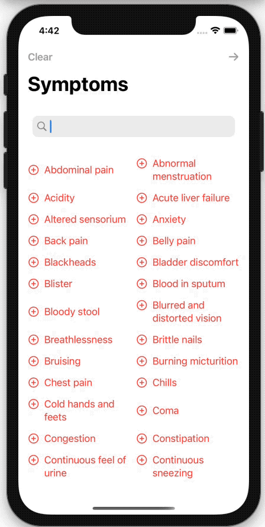

Disease! 🤕
===============
Disease is a sample app that predicts diseases from a set of chosen symptons selected in the app. The app is utilizing a CoreML model trained in CreateML with data downloaded from Kaggle.

The Kaggle data source is [here](https://www.kaggle.com/itachi9604/disease-symptom-description-dataset). 

__If you use this app or fork this repository, never use the prediction as medical advice or a ground truth for a disease.__ This project mainly demonstrates the usage of CoreML models.

## Demo

  

 